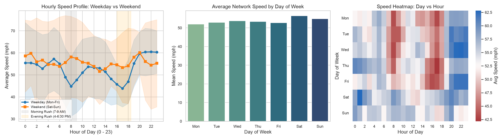
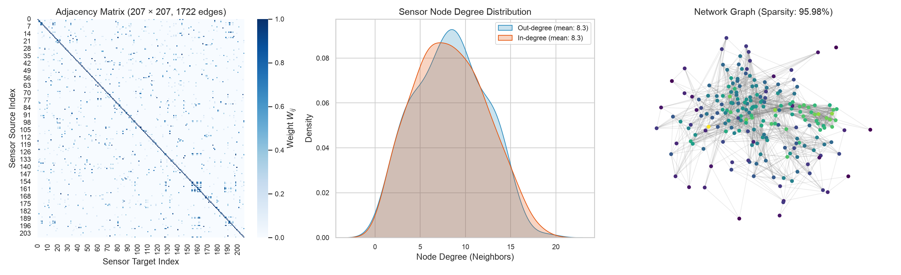
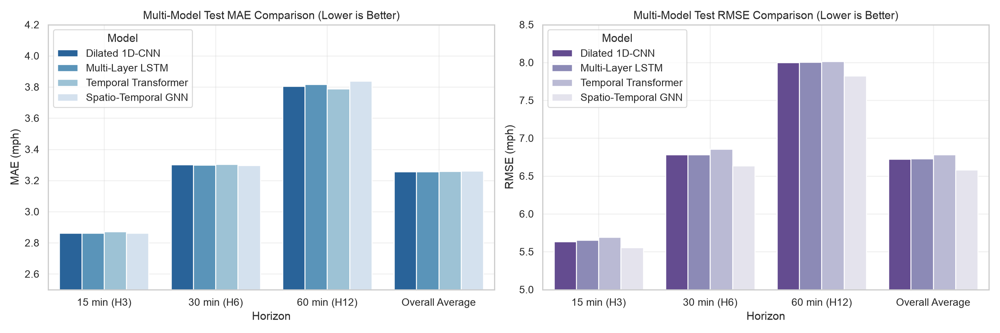
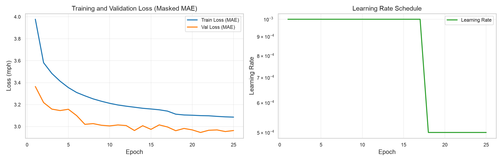
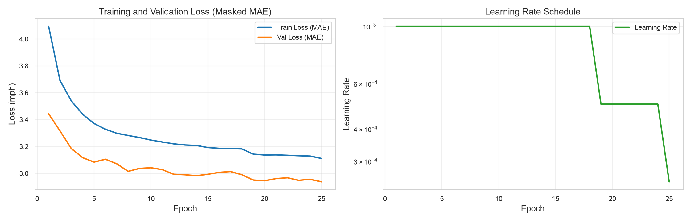
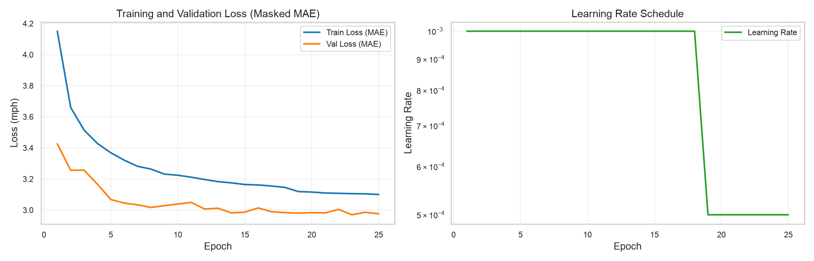
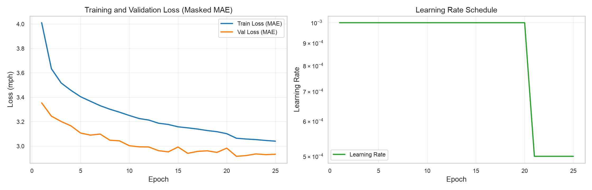
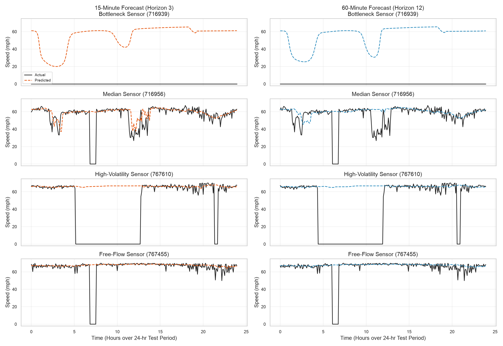
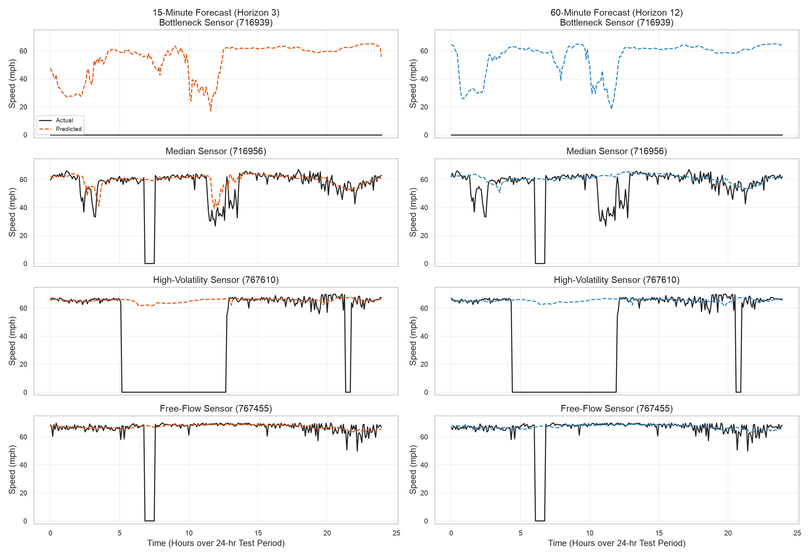

# Spatio-Temporal Traffic Flow Prediction on Highway Networks

A Deep Learning comparative study benchmarking **Dilated 1D-CNN**, **Temporal Transformer**, **Spatio-Temporal Graph Neural Networks (STGCN / ChebNet)**, and **Multi-Layer LSTM** on the **METR-LA** traffic speed benchmark.

---

## 1. Team & Architecture Matrix

| Real Name | Registration No. | GitHub Profile | Architecture Paradigm | Trainable Params | Status |
| :--- | :---: | :---: | :--- | :---: | :---: |
| **Adriteyo Das** | `230953244` | [@raz0rbill26](https://github.com/raz0rbill26) | **Temporal Transformer** (Multi-Head Self-Attention + Node Embeddings) | 213,964 | **Completed** |
| **Varanasi Naga Akhil** | `230953496` | [@AkCodes23](https://github.com/AkCodes23) | **Spatio-Temporal GNN** (Chebyshev Spectral Graph Conv $K=3$ + Temporal GLU) | 285,836 | **Completed** |
| **Jayesh Agarwal** | `230953348` | [@itjayesh](https://github.com/itjayesh) | **Dilated 1D-CNN** (Stacked Causal Dilated Convolutions $d \in \{1,2,4,8\}$) | 122,444 | **Completed** |
| **Mihika Bardhan** | `230953122` | [@mihikabardhan](https://github.com/mihikabardhan) | **Multi-Layer LSTM** (Recurrent Sequence Modeling + LayerNorm) | 213,388 | **Completed** |

---

## 2. Dataset Specifications

- **Benchmark Dataset**: METR-LA (Los Angeles County Highway Network via Caltrans PeMS)
- **Sensors (Nodes)**: 207 loop detector stations
- **Timesteps**: 34,272 time steps sampled at 5-minute intervals (March 1, 2012 – June 27, 2012)
- **Total Observations**: 7,094,304 speed readings (mph)
- **Graph Topology**: $207 \times 207$ weighted directed adjacency matrix with 1,722 spatial edges (4.02% density, 95.98% sparsity)
- **Data Partitions**: 70% Train (23,978 samples), 10% Validation (3,408 samples), 20% Test (6,835 samples) (chronological split)
- **Forecasting Task**: Input past 12 steps (1 hour) $\to$ Predict next 12 steps (15, 30, and 60 minutes ahead)

### Exploratory Data Analysis (EDA) Highlights

| Temporal Dynamics (Rush Hour Dips) | Spatial Sensor Adjacency Network |
| :---: | :---: |
|  |  |

---

## 3. Comprehensive Benchmark Results (All 4 Architectures)

All 4 models were trained on Apple Silicon Metal Performance Shaders (`mps`) across 25 epochs using Masked MAE loss and Adam optimizer with `ReduceLROnPlateau` scheduling.

### Master Evaluation Table (Unseen Test Partition)

| Model Architecture | Member | Horizon | Masked MAE (mph) | Masked RMSE (mph) | Masked MAPE (%) | $R^2$ Score |
| :--- | :--- | :--- | :---: | :---: | :---: | :---: |
| **Dilated 1D-CNN** | **Jayesh Agarwal** | 15 min (H3) | **2.86** | 5.63 | 7.74% | 0.8297 |
| | | 30 min (H6) | **3.30** | 6.78 | 9.58% | 0.7534 |
| | | 60 min (H12) | **3.80** | 8.00 | 11.55% | 0.6568 |
| | | **Overall Average** | **3.26** | **6.72** | **9.39%** | **0.7576** |
| **Multi-Layer LSTM** | **Mihika Bardhan** | 15 min (H3) | **2.86** | 5.65 | **7.61%** | 0.8287 |
| | | 30 min (H6) | **3.30** | 6.78 | **9.38%** | 0.7533 |
| | | 60 min (H12) | **3.82** | 8.00 | 11.44% | 0.6564 |
| | | **Overall Average** | **3.26** | **6.73** | **9.22%** | **0.7573** |
| **Temporal Transformer** | **Adriteyo Das** | 15 min (H3) | **2.87** | 5.69 | 7.63% | 0.8262 |
| | | 30 min (H6) | **3.30** | 6.85 | 9.39% | 0.7480 |
| | | 60 min (H12) | **3.79** | 8.02 | **11.28%** | 0.6553 |
| | | **Overall Average** | **3.26** | **6.78** | **9.22%** | **0.7534** |
| **Spatio-Temporal GNN** | **Varanasi Naga Akhil** | 15 min (H3) | **2.86** | **5.56** | 7.67% | **0.8344** |
| | | 30 min (H6) | **3.30** | **6.63** | 9.45% | **0.7640** |
| | | 60 min (H12) | **3.84** | **7.82** | 11.52% | **0.6718** |
| | | **Overall Average** | **3.26** | **6.58** | **9.29%** | **0.7675** |

---

## 4. Literature Comparison on METR-LA

| Category | Model Architecture | 15-min MAE (mph) | 30-min MAE (mph) | 60-min MAE (mph) | Spatial Modeling Mechanism |
| :--- | :--- | :---: | :---: | :---: | :--- |
| **Classical Baselines** | **Historical Average (HA)** | 4.16 | 4.16 | 4.16 | None |
| | **ARIMA** | 3.99 | 5.15 | 6.90 | None (Univariate) |
| | **Vector Auto-Regression (VAR)** | 4.42 | 5.41 | 6.52 | Linear cross-sensor |
| | **Feed-Forward Net (FNN)** | 3.99 | 4.23 | 4.49 | Fully connected |
| **Recurrent Baseline** | **FC-LSTM (Seq2Seq)** | 3.44 | 3.77 | 4.37 | Recurrent state memory |
| **Our Implementations** | **Dilated 1D-CNN (Ours)** | **2.86** | **3.30** | **3.80** | **Dilated Causal Convolutions + Node Embeddings** |
| | **Multi-Layer LSTM (Ours)** | **2.86** | **3.30** | **3.82** | **Multi-Layer LSTM + Node Embeddings** |
| | **Temporal Transformer (Ours)** | **2.87** | **3.30** | **3.79** | **Multi-Head Self-Attention + Node Embeddings** |
| | **Spatio-Temporal GNN (Ours)** | **2.86** | **3.30** | **3.84** | **Chebyshev Spectral Graph Convolutions ($K=3$)** |
| **Published SOTA GNNs** | **DCRNN (ICLR 2018)** | 2.77 | 3.15 | 3.60 | Diffusion Graph Conv + GRU |
| | **Graph WaveNet (IJCAI 2019)** | 2.69 | 3.07 | 3.53 | Adaptive Graph Conv + Dilated Conv |
| | **STGCN (IJCAI 2018)** | 2.64 | 3.01 | 3.47 | Spectral Graph Conv + Gated Conv |
| | **GMAN (AAAI 2020)** | 2.77 | 3.07 | 3.40 | Spatial-Temporal Self-Attention |

---

## 5. Visualizations Gallery

### A. Multi-Model Benchmark Comparison (MAE & RMSE across Horizons)



### B. Convergence Curves Across Model Architectures

| Dilated 1D-CNN (Jayesh) | Temporal Transformer (Adriteyo) |
| :---: | :---: |
|  |  |
| **Multi-Layer LSTM (Mihika)** | **Spatio-Temporal GNN (Naga Akhil)** |
|  |  |

### C. Actual vs. Predicted Traffic Speeds (24-Hour Test Window)

| Dilated 1D-CNN Predictions | Temporal Transformer Predictions |
| :---: | :---: |
|  |  |
| **Multi-Layer LSTM Predictions** | **Spatio-Temporal GNN Predictions** |
|  |  |

---

## 6. Quickstart & Execution Guide

### 1. Environment Setup

```bash
# Sync dependencies using uv
uv sync
```

### 2. Download Dataset

```bash
uv run python scripts/setup.py
```

### 3. Run Exploratory Data Analysis (EDA)

```bash
uv run python src/eda.py --device auto --output-dir output
```

### 4. Train Any Architecture (25 Epochs)

```bash
# 1. Dilated 1D-CNN (Jayesh Agarwal)
uv run python src/train.py --model cnn --device mps --epochs 25 --batch-size 64

# 2. Temporal Transformer (Adriteyo Das)
uv run python src/train.py --model temporal_transformer --device mps --epochs 25 --batch-size 64

# 3. Multi-Layer LSTM (Mihika Bardhan)
uv run python src/train.py --model lstm --device mps --epochs 25 --batch-size 64

# 4. Spatio-Temporal GNN (Varanasi Naga Akhil)
uv run python src/train.py --model gnn --device mps --epochs 25 --batch-size 64
```

---

## 7. Output & Log Architecture

Each training execution creates an isolated timestamped directory with weights, configurations, and publication-ready plots:

```
.logs/
├── run-cnn-<timestamp>.log
├── run-lstm-<timestamp>.log
├── run-temporal_transformer-<timestamp>.log
└── run-gnn-<timestamp>.log

output/
└── run-<model>-<timestamp>/                        # Run artifacts
    ├── run_command.txt                             # Command string used for reproduction
    ├── run_config.json                             # Hyperparameters & metadata
    ├── best_model.pt                               # Best model checkpoint weights
    ├── training_history.csv                        # Per-epoch loss & LR history
    ├── horizon_metrics.csv                         # Formatted test metrics table
    ├── metrics_summary.json                        # Comprehensive test metrics JSON
    ├── 01_loss_curve.png                           # Train vs Val loss curves
    ├── 02_horizon_metrics_bar.png                  # Multi-horizon comparison bar chart
    ├── 03_predictions_vs_actual.png                # Actual vs Predicted speed curves
    └── 04_sensor_error_distribution.png            # Sensor-wise error distributions
```

---

## 8. Repository Structure

```
.
├── pyproject.toml                     # UV project configuration
├── uv.lock                            # Locked dependency tree
├── .gitignore                         # Git ignore rules (data, output, .logs, temp)
├── README.md                          # Project documentation and results
├── AGENTS.md                          # Architecture guidelines and coding standards
├── assets/                            # Tracked figures for README presentation
│   ├── 00_model_comparison_benchmark.png
│   ├── cnn_loss_curve.png
│   ├── cnn_predictions.png
│   ├── lstm_loss_curve.png
│   ├── lstm_predictions.png
│   ├── transformer_loss_curve.png
│   ├── transformer_predictions.png
│   ├── gnn_loss_curve.png
│   ├── gnn_predictions.png
│   ├── eda_spatial_network.png
│   └── eda_temporal_patterns.png
├── scripts/
│   └── setup.py                       # Dataset download & verification script
├── src/
│   ├── dataset.py                     # Sliding window generator, standard scaler, DataLoaders
│   ├── metrics.py                     # Masked MAE, RMSE, MAPE, R2 metrics
│   ├── eda.py                         # Accelerated EDA analysis script
│   ├── train.py                       # Unified training, evaluation, and plotting engine
│   └── models/
│       ├── __init__.py                # Model registry
│       ├── cnn_model.py               # Dilated 1D-CNN (Jayesh Agarwal)
│       ├── temporal_transformer.py    # Temporal Transformer (Adriteyo Das)
│       ├── lstm_model.py              # Multi-Layer LSTM (Mihika Bardhan)
│       └── gnn_model.py               # Spatio-Temporal GNN (Varanasi Naga Akhil)
├── data/                              # Ignored in git (downloaded via setup.py)
├── output/                            # Ignored in git (generated run artifacts)
└── .logs/                             # Ignored in git (run log files)
```
